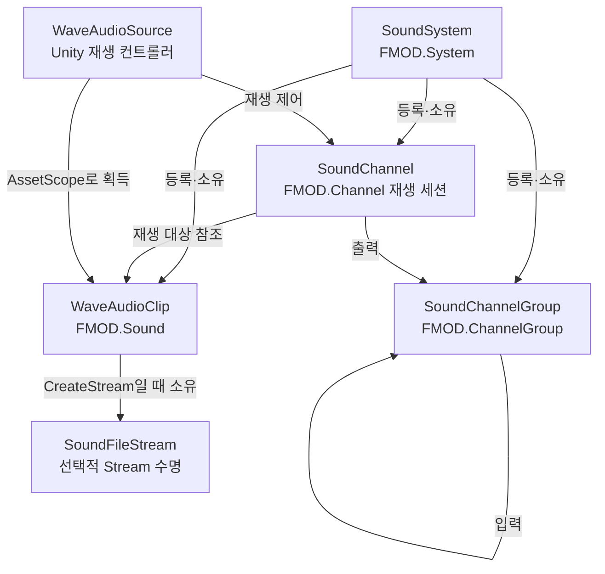

# FMOD SoundSystem

`com.rumi.runios.fmod`의 `SoundSystem`은 FMOD Core API의 `FMOD.System`을 감싸고,
그 시스템에서 생성한 네이티브 오디오 리소스의 생성·재생·해제 순서를 관리하는 수명 경계입니다.

이 문서는 현재 패키지에 구현된 API와 수명·동기화 계약을 설명합니다. 대상은 FMOD Studio 이벤트
시스템이 아니라 FMOD Core의 `System`, `Sound`, `Channel`입니다.

## 이 시스템이 하는 일

- `SoundSystem` 인스턴스의 FMOD Core `System`을 초기화·갱신합니다.
- 인코딩된 바이트, raw PCM, `Stream`, `IONode`에서 `WaveAudioClip`을 만듭니다.
- `WaveAudioClip`을 재생해 개별 재생 세션인 `SoundChannel`을 반환하고, `SoundChannelGroup`으로 출력 하이어라키를 구성합니다.
- 생성한 clip/channel/channel group을 시스템에 등록하고, 종료 시 남은 리소스의 해제가 끝난 뒤 FMOD System을 해제합니다.
- `ReaderWriterLockSlim`으로 일반 FMOD 호출과 시스템 해제가 동시에 실행되지 않게 합니다.
- 무거운 생성 작업은 `UniTask.RunOnThreadPool`로 옮기되, FMOD `MODE.NONBLOCKING`은 사용하지 않습니다.
- `WaveAudioAssetRegistry`와 연결해 리소스 팩의 사운드 파일을 필요할 때 `WaveAudioClip`으로 로드합니다.

각 `WaveAudioClip`과 `SoundChannelGroup`은 자신을 만든 `SoundSystem`에 귀속됩니다. clip은 같은 시스템의
`PlaySound`로만 재생하며, group 하이어라키와 routing 유효성은 FMOD가 결정합니다.

## 구성과 소유 관계



| 타입 | 역할 | 수명 책임 |
| --- | --- | --- |
| `SoundSystem` | 자신의 FMOD Core System과 등록 리소스의 루트 소유자 | 인스턴스 수명 소유자가 자식 리소스를 정리한 뒤 `Dispose()`합니다. |
| `WaveAudioClip` | `FMOD.Sound`의 관리형 래퍼. 길이, 샘플 수, 포맷, 루프, stream 상태를 제공합니다. | 사용이 끝나면 `Dispose()`합니다. `CreateStream`으로 만들었다면 연결된 `Stream`도 기본적으로 이때 닫힙니다. |
| `SoundChannel` | 한 번의 재생을 나타내는 `FMOD.Channel` 래퍼 | `Stop()` 또는 `Dispose()`가 네이티브 채널을 중지하고 시스템 등록에서 제거합니다. |
| `SoundChannelGroup` | `FMOD.ChannelGroup`의 관리형 래퍼. channel/group 입력을 섞는 submix입니다. | `Dispose()`가 group만 release합니다. FMOD는 입력 channel/group을 master group으로 옮기며, 입력 wrapper를 dispose하지 않습니다. |
| `WaveAudioSource` | `AssetRef<WaveAudioClip>`을 재생하는 Unity `MonoBehaviour` | 재생 시간 보간, 속성 동기화, 3D 위치 갱신을 담당하는 상위 컨트롤러입니다. `SoundSystem` 자체의 수명 소유자는 아닙니다. |

`WaveAudioClip`, `SoundChannel`, `SoundChannelGroup`은 생성 시 자동으로 해당 `SoundSystem`에 등록됩니다. 따라서
시스템 해제 중에도 추적 가능한 리소스이며, 한 시스템에서 만든 clip은 다른 시스템의 `PlaySound`에
전달할 수 없습니다.

## 리소스 해제와 시스템 종료 라이프사이클

`SoundChannel`, `WaveAudioClip`, `SoundChannelGroup`은 생성될 때 `SoundSystem`에 등록됩니다. 등록된 리소스의 해제는
"누가 먼저 해제권을 얻었는가"로 결정됩니다. `ownedResources.TryRemove(resource)`에 성공한 호출 하나만
실제 `ReleaseUnmanagedResources()`를 실행하며, 나머지 직접·queued 해제 요청은 no-op입니다.

```text
직접 Dispose(resource)
-> read lock 안에서 system 상태 확인, ownedResources에서 resource 제거, in-flight count 증가
-> read lock 해제
-> ReleaseUnmanagedResources() 호출  // SoundSystem lock 없음
-> in-flight count 감소
```

따라서 `ISoundSystemResource.ReleaseUnmanagedResources()`는 다음 계약을 지켜야 합니다.

- 반복 호출을 허용하고 네이티브 정리를 최대 한 번만 수행합니다.
- 반환 전에 자기 네이티브 정리를 끝냅니다. fire-and-forget 작업이 나중에 FMOD handle을 만지면 안 됩니다.
- 실행 중 소유 `SoundSystem.Dispose()`를 동기 호출하거나 자기 자신을 다시 등록하지 않습니다.

### 자연 종료한 `SoundChannel`

FMOD가 채널 종료를 보고하면 callback은 채널을 직접 해제하지 않고 `QueueDispose(channel)`만 호출합니다.
`SoundSystem.Update()`는 `native.update()`의 read lock을 푼 뒤 queue를 drain하고, 그때 일반
`Dispose(resource)`와 같은 경로로 채널을 해제합니다.

```text
FMOD CHANNELCONTROL_CALLBACK_TYPE.END
-> QueueDispose(channel)
-> SoundSystem.Update()의 native.update() 종료
-> queuedDisposals dequeue
-> Dispose(channel)
```

자연 종료 뒤의 명시적 `channel.Dispose()`는 안전하지만 보통 필요하지 않습니다. 중복 요청은 첫 번째
해제권 확보 뒤 no-op이 됩니다.

### `SoundSystem` 생성과 `Reset()`

`SoundSystem.main`은 `maxChannels = 4095`, `INITFLAGS.NORMAL`로 생성됩니다. 별도 시스템은 public
생성자에서 init 전 설정을 지정할 수 있으며, 소유자가 직접 `Update()`와 `Dispose()`를 호출해야 합니다.

```csharp
using SoundSystem system = new(new SoundSystemSettings
{
    softwareChannels = 256,
    softwareFormat = new SoundSystemSoftwareFormat(48000, FMOD.SPEAKERMODE.STEREO),
    dspBuffer = new SoundSystemDSPBuffer(512, 4)
});
```

`Reset(settings)`은 non-null field만 현재 저장 설정에 병합한 뒤, 시스템이 소유한 리소스를 해제하고
같은 native system을 `close()`/`init()` 합니다. 리소스 해제 예외는 로그로 출력하고 남은 리소스 정리와
네이티브 재초기화를 계속합니다. native close, 설정 적용 또는 init 실패 뒤에는 병합 설정을 보존하므로,
잘못된 field만 바꾼 다음 `Reset()`을 다시 호출할 수 있습니다. Reset이 해제한 리소스의 재로드는 수행하지 않습니다.
`onResetting`은 lifecycle 상태 변경 및 소유 리소스 해제 직전에, `onReset`은 재초기화 성공 및 활성 상태 복귀 직후 발생합니다.

### `SoundSystem.Dispose()`

시스템 종료는 resource 구현 코드를 `nativeLock` 안에서 호출하지 않습니다.

```text
write lock 획득                         // 기존 read 작업과 resource 해제권 확보가 끝날 때까지 대기
-> lifecycleState = Disposed            // 새 등록·해제권 확보 차단
-> queuedDisposals 분리
-> 남은 ownedResources snapshot 후 Clear
-> write lock 해제
-> 이미 실행 중인 resource release 완료 대기
-> snapshot resource 각각 ReleaseUnmanagedResources() 호출  // SoundSystem lock 없음
-> write lock 획득
-> FMOD.System.release()
-> native handle 제거
-> write lock 해제
```

리소스 해제 예외와 마지막 `FMOD.System.release()` 실패는 로그로 출력하고, 남은 종료 절차를 계속합니다.

`ownedResources` snapshot은 동시성 락 자체가 아니라 소유권 전이입니다. static `SoundSystem.main`이
계속 살아 있어도 종료된 resource wrapper를 dictionary가 계속 참조하지 않게 하고, 외부 resource 구현을
호출하기 전에 시스템의 소유 목록을 비웁니다.

`QueueDispose()`와 종료가 동시에 일어날 수 있습니다. shutdown이 queue를 분리한 직후 이전 queue에
enqueue된 항목은 drain되지 않을 수 있지만, 그 resource는 이미 shutdown snapshot에 있거나 실행 중인
release로 추적됩니다. 그러므로 native release가 누락되거나 두 번 실행되지는 않습니다.

일반 사용자는 다음 순서를 지키는 편이 이해하기 쉽습니다.

```text
SoundChannel.Stop() 또는 Dispose()
-> SoundChannelGroup.Dispose()  // 필요할 때만; 남은 입력은 FMOD가 master로 재라우팅
-> WaveAudioClip.Dispose()
-> SoundSystem.Dispose()  // 시스템 종료·에디터 리로드 시점
```

시스템 종료 시 dictionary 열거 순서에 channel 우선 규칙은 없습니다. 특별한 의존 관계가 있는 리소스는
시스템 종료 전에 호출자가 명시적으로 정리해야 합니다.

그 밖의 수명 규칙:

- `CreateStream(Stream, leaveOpen: false)`의 반환 clip은 FMOD 파일 콜백과 원본 stream을 소유합니다.
  clip이 살아 있는 동안 호출자가 stream을 닫으면 안 됩니다. 외부가 stream을 계속 소유해야 하면
  `leaveOpen: true`를 사용합니다.
- 네이티브 `FMOD.System`/`Sound`/`Channel`/`ChannelGroup` handle을 callback 밖으로 저장하거나, 시스템 종료 뒤
  다시 사용하지 않습니다.
- `SoundSystem`은 finalizer로 FMOD를 해제하지 않습니다. 정상 수명 관리는 명시적인 `Dispose()`입니다.

## 동기화 모델

`SoundSystem`은 재귀 read lock을 허용하는 `ReaderWriterLockSlim`과 resource release count를 함께 사용합니다.

```text
일반 public FMOD API
-> read lock
-> disposed 검사
-> FMOD 호출
-> read lock 해제

Dispose(resource)
-> 짧은 read lock으로 해제권 확보
-> read lock 밖에서 resource 구현 호출

SoundSystem.Dispose()
-> 짧은 write lock으로 Closing 전환·소유권 snapshot
-> lock 밖에서 resource release 완료 대기·snapshot 해제
-> 마지막 write lock으로 FMOD.System.release()
```

`activeResourceDisposals`는 `nativeLock` 밖에서 실행 중인 resource release 수입니다. system 종료는 이 수가
0이 될 때까지 `Monitor.Wait`으로 대기하며, 마지막 release가 `Monitor.PulseAll`로 깨웁니다. 이 count가
resource를 dictionary에서 제거한 뒤 system이 먼저 `native.release()`하는 경합을 막습니다.

`Execute(...)` 안에서 같은 스레드로 다시 public API를 호출하는 경우도 재귀 read lock으로 처리됩니다.

### `Execute`와 `UseNative`

`Execute`는 여러 동기 작업을 시스템 해제에 대해 하나의 보호 구간으로 묶습니다.

```csharp
bool success = system.Execute(system =>
{
    WaveAudioClip a = system.CreateSound(bytesA);
    WaveAudioClip b = system.CreatePCM(pcmB, 2, 48_000, PCMFormat.Float);

    // a, b를 등록하거나 즉시 사용하는 동기 작업
});
```

현재 구현에서 시스템이 이미 해제된 경우 `Execute`는 예외 대신 `false`를 반환합니다.
`Execute<T>`는 같은 의미의 `success`와 `result`를 반환합니다.

`UseNative`은 관리 래퍼에 아직 없는 FMOD Core API를 짧은 동기 callback 안에서 호출하기 위한
escape hatch입니다. `SoundSystem`, `WaveAudioClip`, `SoundChannel`, `SoundChannelGroup` 각각에 대응 API가 있습니다.

```csharp
system.UseNative(nativeSystem =>
{
    // callback 안에서만 nativeSystem 사용
});
```

두 callback의 공통 계약은 다음입니다.

- callback은 같은 스레드에서 동기적으로 끝나야 합니다.
- callback 안에서 `await`, ThreadPool 전환, `GetAwaiter().GetResult()`를 사용하지 않습니다.
- raw handle을 callback 밖으로 보관하지 않습니다.

락을 잡은 스레드와 풀어야 하는 스레드가 달라질 수 있으므로, 외부에 `using` 가능한 lock scope는
노출하지 않습니다.

## 생성 API와 비동기 경로

| 목적 | 동기 API | 비동기 API | 비고 |
| --- | --- | --- | --- |
| 인코딩된 오디오 메모리 | `CreateSound(byte[], keepCompressed)` | `CreateSoundAsync(byte[], keepCompressed)` | `keepCompressed`는 compressed sample 보존 여부입니다. |
| 인코딩된 오디오 I/O | `CreateSound(Stream, ...)` | `CreateSoundAsync(Stream, ...)`, `CreateSoundAsync(IONode, ...)` | `IONode`/비동기 stream 읽기는 FMOD lock 밖에서 끝냅니다. |
| raw PCM | `CreatePCM(byte[], channel, frequency, PCMFormat)` | `CreatePCMAsync(...)` | `PCM8`, `PCM16`, `PCM24`, `PCM32`, `Float`을 지원합니다. |
| FMOD streaming | `CreateStream(Stream, leaveOpen)` | `CreateStreamAsync(Stream, leaveOpen)`, `CreateStreamAsync(IONode)` | 반환 clip이 stream 수명을 관리합니다. |
| channel group | `CreateChannelGroup(string)` | 없음 | 반환 group은 시스템이 수명을 추적합니다. |
| 재생 | `PlaySound(WaveAudioClip, paused)`, `PlaySound(WaveAudioClip, SoundChannelGroup, paused)` | 없음 | `SoundChannel`을 반환합니다. |

비동기 생성은 다음 순서입니다.

```text
IONode/Stream 비동기 읽기 또는 열기
-> ThreadPool에서 동기 Create* 호출
-> read lock + disposed 검사
-> FMOD Sound 생성 완료
-> WaveAudioClip 반환
```

즉 `Create*Async`의 완료는 FMOD 비동기 open 상태를 폴링한 결과가 아니라, ThreadPool에서 수행한
동기 생성이 끝났다는 뜻입니다. 시스템 해제가 먼저 완료되면 worker의 생성 단계에서
`ObjectDisposedException`이 await 지점으로 전달될 수 있습니다.

`CreateSoundAsync`, `CreatePCMAsync`, `CreateStreamAsync`는 현재 스레드가 SoundSystem lock을
소유한 상태라면 즉시 실패시켜 `Execute` 내부의 잘못된 비동기 호출을 막습니다.

> `ExecuteOnThreadPool(...)`은 동기 callback을 worker thread에서 실행하는 편의 API입니다.
> 다만 구현에는 lock-held 검사가 없으므로, `Execute`/`UseNative` callback 내부에서
> 호출하거나 그 결과를 동기 대기하면 안 됩니다.

## 재생과 리소스 로드 예

```csharp
using Cysharp.Threading.Tasks;
using RuniOS.IO;
using RuniOS.Sounds;

async UniTask PlayOnce(SoundSystem system, IONode node)
{
    WaveAudioClip clip = await system.CreateSoundAsync(node);

    try
    {
        SoundChannel channel = system.PlaySound(clip);

        try
        {
            await UniTask.WaitUntil(() => !channel.isPlaying);
        }
        finally
        {
            // 자연 종료한 channel은 Update가 자동 해제한다. 호출해도 중복 해제는 no-op이다.
            channel.Dispose();
        }
    }
    finally
    {
        clip.Dispose();
    }
}
```

raw PCM을 이미 메모리에 가지고 있다면 다음 경로를 사용합니다.

```csharp
WaveAudioClip clip = await system.CreatePCMAsync(
    pcm,
    channel: 2,
    frequency: 48_000,
    format: PCMFormat.Float);
```

리소스 팩 경로에서는 `WaveAudioAssetRegistry`가 `sounds` 폴더의 음악 파일을 `WaveAudioAssetHandle`로
등록합니다. handle은 필요할 때 `SoundSystem.main.CreateSoundAsync(IONode)`로 clip을 만들고,
언로드 시 `WaveAudioClip.Dispose()`를 호출합니다. `WaveAudioSource`는 이 clip을 `AssetRef`/scope로
획득해 Unity 오브젝트의 재생 상태, 보간 시간, 3D 속성을 동기화하는 소비자입니다.

## `SoundChannel`이 제공하는 것

`SoundChannel`은 재사용 가능한 AudioSource가 아니라 disposable 재생 세션입니다. 주요 기능은 다음과
같습니다.

- 재생 상태, 일시 정지, PCM sample/초 단위 위치, 루프 지점과 횟수
- DSP clock 기반 시작/종료 예약과 볼륨 fade point
- 볼륨, pitch, mute, pan, mix matrix, reverb send
- 위치/속도, 거리 감쇠, 2D↔3D blend, 도플러, spread, cone, occlusion
- `UseNative`을 통한 아직 래핑되지 않은 `FMOD.Channel` 기능

리듬 게임처럼 위치 정밀도가 중요한 경로는 `timeSample`, `lengthSample`, `loopStartSample`,
`loopEndSample` 같은 sample 단위 API를 우선 사용하고, 초 단위 속성은 편의 API로 사용합니다.

## `SoundChannelGroup` 하이어라키

`SoundChannelGroup`은 native `FMOD.ChannelGroup`의 수명만 보호하는 얇은 래퍼입니다.
`AddGroup(child, propagateDSPClock)`은 FMOD `ChannelGroup.addGroup`을 직접 호출하며, parent/child
관계·cycle·재부모화 순서·child 수명을 관리 코드에서 추적하지 않습니다. 같은 child를 다른 parent에 추가하거나
유효하지 않은 하이어라키를 요청했을 때의 결과는 FMOD가 반환하는 결과를 따릅니다.

```csharp
SoundChannelGroup music = system.CreateChannelGroup("music");
SoundChannelGroup combat = system.CreateChannelGroup("combat");

music.AddGroup(combat);

SoundChannel channel = system.PlaySound(clip, combat);
channel.SetChannelGroup(music);
```

`SoundChannelGroup.Dispose()`는 group을 release할 뿐 channel 또는 child group wrapper를 dispose하지 않습니다.
FMOD는 그 group에 입력되던 channel/group을 master group으로 재라우팅합니다. `AddGroup`은 두 group의 native
handle이 dispose와 경합하지 않도록 보호하지만, 별도 hierarchy lock이나 managed tree를 만들지 않습니다.

## 하지 말아야 할 사용

```csharp
// 금지: read lock callback에서 비동기 생성/대기를 섞음
system.Execute(_ =>
{
    system.CreateSoundAsync(bytes)
        .GetAwaiter()
        .GetResult();
});
```

- `Execute` 또는 `UseNative` 안에서 `await`하지 않습니다.
- `Execute` 또는 `UseNative` 안에서 ThreadPool 작업을 동기 대기하지 않습니다.
- 메인 스레드에서 `UniTask`를 `.GetAwaiter().GetResult()`로 기다리지 않습니다.
- 해당 인스턴스의 수명 소유자가 아닌 코드에서 `SoundSystem.Dispose()`를 호출하지 않습니다.
- 다른 `SoundSystem`이 만든 clip을 `PlaySound`에 넘기지 않습니다.
- 재생 중인 channel보다 먼저 clip을 dispose하거나, 살아 있는 stream을 먼저 닫지 않습니다.
- group release가 child wrapper까지 dispose한다고 가정하지 않습니다.

이 경계를 지키면 시스템 해제와 일반 FMOD 호출이 겹쳐도 해제된 네이티브 리소스에 접근하지 않고,
비동기 생성/리소스 언로드/에디터 리로드를 같은 소유 규칙으로 다룰 수 있습니다.
